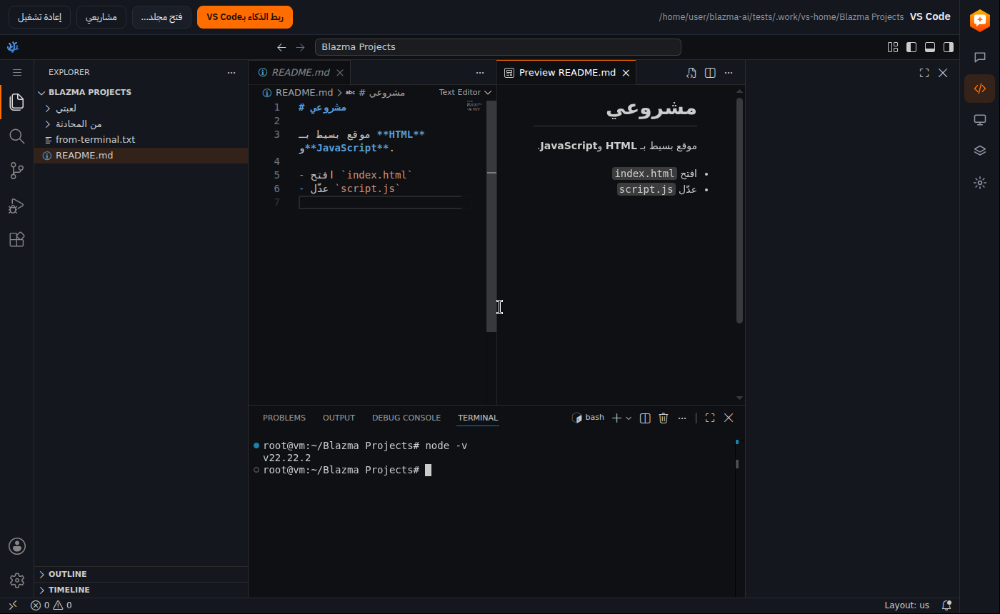

<div dir="rtl">

<p align="center"></p>

# Blazma AI

تطبيق ويندوز مجاني ومفتوح المصدر بواجهة عربية كاملة، يجمع ثلاثة أشياء:

1. **محادثة مع ذكاء اصطناعي يعمل على جهازك** بكرت الشاشة أو المعالج (موديلات مفتوحة فوق محرك [llama.cpp](https://github.com/ggml-org/llama.cpp)): يفهم الصور والملفات، ويبحث في الإنترنت، ويجيب من مستنداتك، ويسمع صوتك، ويقرأ ردوده، ويرسم الصور. بدون اشتراك، ومحادثاتك لا تخرج من جهازك.
2. **لوحة مراقبة حيّة للجهاز**: كرت الشاشة والمعالج والذاكرة والحرارة وسحب الطاقة، مع شاشة مصغرة فوق المحادثة مثل الألعاب.
3. **VS Code الكامل داخل البرنامج**، والذكاء داخله مربوط بالموديل الذي يعمل على جهازك.

> ⚠️ كل الميزات مُختبرة على لينكس باختبارات تشغيل كاملة. على ويندوز جُرّب حتى الآن: التثبيت، وتنزيل المحرك وتشغيله على كرت RTX 5070، وتنزيل VS Code وفتحه وتثبيت إضافة الذكاء. الباقي يُجرَّب بحسب [قائمة التحقق](docs/CHECKLIST-WINDOWS.md).

## التثبيت

1. نزّل `Blazma-AI-Setup-<الإصدار>.exe` من صفحة [Releases](https://github.com/mr-kateba/blazma-ai/releases).
2. شغّله واختر مكان التثبيت.
   - البرنامج غير موقّع رقمياً بعد، فقد يظهر تحذير SmartScreen. اضغط "مزيد من المعلومات" ثم "تشغيل على أي حال".
3. عند أول تشغيل يفحص البرنامج جهازك، ويقترح الموديل المناسب، وينزّل المحرك والموديل مرة واحدة. بعدها تشرح لك جولة قصيرة كل صفحة وكل زر.

**المتطلبات:** ويندوز 10 أو 11 (64 بت)، ومساحة فاضية بقدر الموديل (من 1 إلى 8 جيجابايت للموديلات المقترحة). كرت NVIDIA يعطي أفضل سرعة، وبدونه يعمل على المعالج بموديل صغير.

| المحادثة | VS Code |
|---|---|
|  |  |
| **جهازي** | **الموديلات** |
|  |  |

الصور ملتقطة في بيئة اختبار على لينكس، وقراءات كرت الشاشة فيها من محاكٍ للاختبار وليست من جهاز حقيقي.

## الحالة الحالية

| الجزء | الحالة |
|---|---|
| هيكل التطبيق والأمان والواجهة العربية | ✅ يعمل |
| فحص الجهاز واقتراح الموديل المناسب | ✅ يعمل |
| تنزيل محرك llama.cpp تلقائياً واختيار نسخة CUDA المناسبة لتعريفك | ✅ يعمل (جُرّب على ويندوز + RTX 5070) |
| تنزيل الموديل بتقدّم حقيقي، والاستكمال تلقائياً بعد انقطاع الإنترنت | ✅ يعمل |
| المحادثة: بث الرد، منطقة "يفكّر"، اتجاه النص التلقائي، markdown آمن، زر إيقاف | ✅ يعمل |
| إرسال صور للموديل ليفهمها (إرفاق، لصق، سحب) | ✅ يعمل (جُرّب على لينكس بـQwen3.5 2B) |
| إرفاق ملفات في المحادثة: PDF وWord والنصوص والكود (العربي في PDF يُقرأ بالترتيب الصحيح) | ✅ مُجرّب |
| ضغط ذاكرة المحادثة (KV cache) لمحادثات أطول بنفس الكرت | ✅ |
| الشخصيات (مترجم، مدرّس، مبرمج، مدقق لغوي، كاتب، ملخِّص، وشخصياتك الخاصة) وتصدير المحادثة إلى Markdown أو PDF | ✅ مُجرّب |
| تشغيل ملف GGUF من جهازك، واستخدام موديلات Ollama المنزّلة بدون تنزيلها مرة ثانية | ✅ مُجرّب ببنية Ollama، ⚠️ يُجرَّب مع Ollama حقيقي |
| **VS Code** الكامل (VSCodium) داخل البرنامج بدل الاستوديو السابق: طرفية حقيقية، وأي لغة، وتصحيح الأخطاء، وGit، والإضافات من Open VSX، والذكاء عبر Continue | ✅ مُجرّب على لينكس (الطرفية، ومعاينة Markdown بدون إنترنت، ونقل المشاريع القديمة)، وعلى ويندوز: التنزيل والتثبيت وفتح المجلد وتثبيت Continue. ⚠️ محادثة Continue نفسها على ويندوز لم تُجرَّب بعد |
| حفظ المحادثات والبحث فيها، إعادة التوليد، تعديل الرسائل، "أعطِ الذكاء معلومات جهازي"، حفظ الكود كملف | ✅ مُجرّب |
| البحث في الإنترنت وقراءة الصفحات (الموديل يقرر متى، مع المصادر تحت الإجابة) | ✅ حلقة الأدوات مُجرّبة بالموديل الحقيقي، ⚠️ الاتصال الفعلي بـDuckDuckGo من داخل التطبيق يُجرَّب على ويندوز |
| إيقاف المحرك عند إغلاق التطبيق وتنظيفه بعد الانهيار | ✅ يعمل |
| رسائل الأخطاء بالعربي مع اقتراح الحل | ✅ يعمل |
| العمل بدون كرت NVIDIA (على المعالج بموديل صغير) | ✅ يعمل |
| مقارنة Qwen3.5 9B وGemma 4 12B على كرت الشاشة | ⏳ تحتاج تجربة على جهاز فيه كرت NVIDIA |
| لوحة "جهازي": قراءات حيّة، رسوم لآخر 5 دقائق، تنبيهات حرارة، اختبار أداء، تصدير تقرير | ✅ مكتوبة ومُختبرة على لينكس، ⚠️ بانتظار مطابقة الأرقام على ويندوز ([القائمة](docs/CHECKLIST-WINDOWS.md)) |
| صفحة الموديلات: تنزيل وتبديل بدون إعادة تشغيل، حذف من الجهاز، إضافة موديل من Hugging Face بعد التحقق منه | ✅ مُجرّب على لينكس |
| صفحة الإعدادات الكاملة: تعليمات الذكاء، درجة الإبداع، ذاكرة المحادثة، طبقات الكرت، المنفذ، مجلد الموديلات، التشغيل مع ويندوز، التحقق من التحديثات وتحديث المحرك | ✅ مُجرّب على لينكس، ⚠️ تحديث المحرك والتشغيل مع ويندوز يُجرَّبان على ويندوز |
| المحادثة: شاشة ترحيب باقتراحات، تبديل الموديل من أعلى المحادثة، تجميع المحادثات حسب التاريخ، اختصارات Ctrl+1 إلى Ctrl+5 للصفحات | ✅ مُجرّب |
| تنظيم المحادثات: تثبيت في الأعلى، ومجلدات، ونسخة احتياطية لكل المحادثات في ملف واحد واستعادتها (الإعدادات ← المحادثة) | ✅ مُجرّب على لينكس |
| أوامر سريعة: اكتب `/` لقائمة الأوامر (ترجم، لخّص، صحّح، اشرح، أعد الصياغة، نقاط، رسالة، كود) | ✅ مُجرّب على لينكس بالموديل الحقيقي |
| ملف التنصيب (NSIS) والأيقونة، وبناؤه تلقائياً على ويندوز عبر GitHub Actions | ✅ يُبنى على ويندوز، ومُجرّب التثبيت عليه |
| نسخ الردود: إعادة التوليد والتعديل يحفظان النسخ السابقة مع أسهم للتنقل | ✅ مُجرّب على لينكس |
| زر "استمع": صوت Blazma العربي (Piper على جهازك، يُنزَّل مرة واحدة) أو أصوات ويندوز | ✅ التنزيل والقراءة مُجرّبان على لينكس بصوت اختبار، وwhisper.cpp فهم الكلام المقروء حرفياً. ⚠️ الصوت العربي نفسه (kareem) لم يُسمع هنا لأن Hugging Face محجوب في بيئة الاختبار |
| مكتبتي: الإجابة من مستنداتك مع ذكر الملف (Qwen3-Embedding) | ✅ مُجرّب على لينكس (8 ملفات PDF وWord وHTML ونصوص، والسؤال الإنجليزي وجد الملاحظة العربية) |
| الإدخال بالصوت (whisper.cpp) | ✅ مُجرّب على لينكس بتسجيل عربي حقيقي من ميكروفون محاكى، ⚠️ تنزيل نسخة ويندوز وتشغيلها يُجرَّبان على ويندوز |
| رسم الصور (stable-diffusion.cpp وZ-Image Turbo) | ✅ مُجرّب على لينكس بالمعالج، ⚠️ نسخة Vulkan على كرت الشاشة تُجرَّب على ويندوز |
| المظهر الفاتح | ✅ مُجرّب في كل الصفحات |
| جولة تعريفية عند أول تشغيل، وتلميحات بتصميم البرنامج، وإعدادات مرتبة في أقسام | ✅ مُجرّب على لينكس |
| إخراج الموديل من الذاكرة عند عدم الاستخدام، وتسريع الكتابة (تجريبي) | ✅ مُجرّب على لينكس |
| تحديث البرنامج من داخله | ⚠️ مكتوب، ولا يمكن تجربته إلا على ويندوز بإصدارين منشورين |

خطة البناء الكاملة في [docs/PLAN.md](docs/PLAN.md).

## كيف يعمل

1. **أول تشغيل:** يفحص التطبيق كرت الشاشة عبر `nvidia-smi`، ويقترح موديلاً يناسب ذاكرة الكرت.
2. **المحرك:** ينزّل أحدث إصدار ويندوز من [llama.cpp على GitHub](https://github.com/ggml-org/llama.cpp/releases). أسماء الملفات تُقرأ من الإصدار نفسه، ويختار أحدث نسخة CUDA يدعمها تعريف كرتك. بعد التنزيل يتحقق من الحجم ومن بصمة SHA-256، ثم يتأكد أن المحرك يرى الكرت فعلاً. إذا لم يعمل يجرّب نسخة CUDA أقدم، ثم Vulkan، ثم المعالج.
3. **الموديل:** يشغّل `llama-server` بخيار `-hf` فينزّل الموديل من Hugging Face، ومعه ملف الرؤية (mmproj) الذي يسمح له بفهم الصور. يستكمل التنزيل من حيث توقف إذا انقطع الإنترنت. شريط التقدم يقيس حجم الملف الفعلي على القرص، وبعد التنزيل يتحقق التطبيق من بصمة SHA-256 للموديل.
4. **المحادثة:** الواجهة تتصل مباشرة بالخادم المحلي `http://127.0.0.1:<port>/v1/chat/completions` وتعرض الرد كلمة بكلمة.

## الموديلات

| الموديل | الجهة | الملف على Hugging Face | حجم التنزيل | الرخصة | يعمل كاملاً على |
|---|---|---|---|---|---|
| Gemma 4 12B | Google · أمريكا | `unsloth/gemma-4-12b-it-GGUF:UD-Q4_K_XL` | 7.37 GB | Apache-2.0 | كرت 10 جيجابايت (مُجرَّب ومقترح) |
| Qwen3.5 9B | Alibaba · Qwen · الصين | `unsloth/Qwen3.5-9B-GGUF:Q4_K_M` | 5.68 GB | Apache-2.0 | كرت 8 جيجابايت (مُجرَّب ومقترح) |
| Qwen3.5 4B | Alibaba · Qwen · الصين | `unsloth/Qwen3.5-4B-GGUF:Q4_K_M` | 2.74 GB | Apache-2.0 | كرت 4 جيجابايت (مُجرَّب ومقترح) |
| Qwen3.5 2B | Alibaba · Qwen · الصين | `unsloth/Qwen3.5-2B-GGUF:Q4_K_M` | 1.28 GB | Apache-2.0 | المعالج أو أي كرت (مُجرَّب ومقترح) |
| Qwen3.5 0.8B | Alibaba · Qwen · الصين | `unsloth/Qwen3.5-0.8B-GGUF:Q4_K_M` | 0.74 GB | Apache-2.0 | المعالج أو أي كرت |
| Gemma 4 E2B | Google · أمريكا | `unsloth/gemma-4-E2B-it-GGUF:Q4_K_M` | 4.09 GB | Apache-2.0 | المعالج أو أي كرت |
| ALLaM 7B | سدايا · السعودية | `bartowski/ALLaM-AI_ALLaM-7B-Instruct-preview-GGUF:Q4_K_M` | 4.26 GB | Apache-2.0 | كرت 6 جيجابايت |
| Falcon H1 7B | TII · الإمارات | `tiiuae/Falcon-H1-7B-Instruct-GGUF:Q4_K_M` | 4.60 GB | Falcon LLM License | كرت 6 جيجابايت |
| Gemma 4 E4B | Google · أمريكا | `unsloth/gemma-4-E4B-it-GGUF:Q4_K_M` | 5.97 GB | Apache-2.0 | كرت 8 جيجابايت |
| MiMo V2.6 9B | Xiaomi · الصين | `bartowski/MiMo-V2.6-Distill-Qwen-9B-GGUF:Q4_K_M` | 6.76 GB | MIT | كرت 8 جيجابايت |
| gpt-oss 20B | OpenAI · أمريكا | `unsloth/gpt-oss-20b-GGUF:Q4_K_M` | 11.62 GB | Apache-2.0 | كرت 12 جيجابايت |
| ERNIE 4.5 21B Thinking | Baidu · الصين | `unsloth/ERNIE-4.5-21B-A3B-Thinking-GGUF:Q4_K_M` | 13.33 GB | Apache-2.0 | كرت 14 جيجابايت |
| Fanar 2 27B | QCRI · قطر | `mradermacher/Fanar-2-27B-Instruct-i1-GGUF:i1-Q4_K_M` | 16.55 GB | Apache-2.0 | كرت 17 جيجابايت |
| Qwen3.8 27B | Alibaba · Qwen · الصين | `unsloth/Qwen3.8-27B-GGUF:UD-Q4_K_M` | 17.40 GB | Apache-2.0 | كرت 18 جيجابايت |
| GLM 4.7 Flash | Zhipu · Z.ai · الصين | `unsloth/GLM-4.7-Flash-GGUF:UD-Q4_K_XL` | 17.52 GB | MIT | كرت 18 جيجابايت |
| Qwen3 Coder 30B | Alibaba · Qwen · الصين | `unsloth/Qwen3-Coder-30B-A3B-Instruct-GGUF:UD-Q4_K_XL` | 17.67 GB | Apache-2.0 | كرت 18 جيجابايت |
| Gemma 4 26B A4B | Google · أمريكا | `unsloth/gemma-4-26B-A4B-it-GGUF:UD-Q4_K_XL` | 18.21 GB | Apache-2.0 | كرت 18 جيجابايت |
| Gemma 4 31B | Google · أمريكا | `unsloth/gemma-4-31B-it-GGUF:Q4_K_M` | 19.52 GB | Apache-2.0 | كرت 20 جيجابايت |
| Qwen3.6 35B A3B | Alibaba · Qwen · الصين | `unsloth/Qwen3.6-35B-A3B-GGUF:UD-Q4_K_M` | 23.04 GB | Apache-2.0 | كرت 23 جيجابايت |
| Hunyuan MT 7B | Tencent · الصين | `mradermacher/Hunyuan-MT-7B-GGUF:Q4_K_M` | 4.62 GB | Tencent Hunyuan Community License (لا تشمل الاتحاد الأوروبي وبريطانيا وكوريا الجنوبية) | كرت 6 جيجابايت |
| Hunyuan 7B | Tencent · الصين | `bartowski/tencent_Hunyuan-7B-Instruct-GGUF:Q4_K_M` | 4.62 GB | Tencent Hunyuan Community License (لا تشمل الاتحاد الأوروبي وبريطانيا وكوريا الجنوبية) | كرت 6 جيجابايت |
| Aya Expanse 8B | Cohere · كندا | `bartowski/aya-expanse-8b-GGUF:Q4_K_M` | 5.06 GB | CC-BY-NC-4.0 (للاستخدام غير التجاري فقط) | كرت 6 جيجابايت |
| Step 3.7 Flash | StepFun · الصين | `unsloth/Step-3.7-Flash-GGUF:UD-Q2_K_XL` | 65.79 GB | Apache-2.0 | كرت 63 جيجابايت |
| Qwen3.8 Flash Next | Alibaba · Qwen · الصين | `unsloth/Qwen3.8-Flash-Next-GGUF:UD-Q2_K_XL` | 78.87 GB | Qwen Community License | كرت 75 جيجابايت |
| DeepSeek V4 Flash | DeepSeek · الصين | `unsloth/DeepSeek-V4-Flash-0731-GGUF:UD-Q2_K_XL` | 96.83 GB | MIT | كرت 92 جيجابايت |

- 25 موديلاً، منها 15 صينية (Qwen وXiaomi وBaidu وZhipu وTencent وDeepSeek وStepFun)، و3 عربية المنشأ (ALLaM من السعودية، وFalcon من الإمارات، وFanar من قطر).
- البرنامج يقترح فقط من الموديلات الأربعة المجرّبة (Gemma 4 12B وQwen3.5 9B و4B و2B). الباقي تختاره من صفحة الموديلات.
- جرّبنا بالعربية على المعالج: Gemma 4 E2B وALLaM 7B وFalcon H1 7B وAya Expanse 8B (إجابات سليمة)، وHunyuan MT 7B (ترجمة دقيقة في الاتجاهين)، وQwen3.5 0.8B وHunyuan 7B (ضعيفان بالعربية، ومذكور في وصفهما). الموديلات الأكبر لم تُجرَّب هنا لعدم وجود كرت شاشة.
- العملاقة (DeepSeek V4 Flash وQwen3.8 Flash Next وStep 3.7 Flash) بضغط 2 بت (66 إلى 97 جيجابايت)، لأجهزة العمل القوية.
- **لم يُضَف:** Ling 3.0 (يعطي كلاماً مكسّراً أو يتوقف في المحرك الحالي)، وGLM 5.3 Flash (يحتاج نسخة من llama.cpp لم تُعتمد بعد)، وKimi K3 (1500 جيجابايت).
- **أي موديل آخر:** صفحة الموديلات تشغّل أي ملف GGUF موجود عندك: ملف، أو مجلد كامل (يُفحص بمجلداته الفرعية)، أو موديلات LM Studio (`~/.lmstudio/models`) وOllama، أو بالسحب والإفلات. الموديل المقسوم إلى أجزاء (`-00001-of-0000N`) يُضاف بجزئه الأول، والملفات تبقى في مكانها.
- **الواجهة البرمجية (API):** من الإعدادات تقدر تسمح لبرامجك الأخرى على نفس الجهاز باستخدام الموديل الذي يعمل، بصيغة OpenAI على `http://127.0.0.1:<المنفذ>/v1` وبمفتاح ثابت. معطّلة افتراضياً.
- **طبقات الكرت (تلقائي):** إذا لم يتسع الموديل في ذاكرة الكرت، يترك محرك llama.cpp جزءاً منه في ذاكرة الجهاز فيعمل أبطأ بدل أن يفشل. موديلات MoE (التي تشغّل جزءاً صغيراً من معاملاتها لكل كلمة) تبقى سريعة نسبياً بهذه الطريقة.
- الأحجام والرخص من صفحات الموديلات على Hugging Face.
- إعدادات التوليد لكل موديل (temperature وtop_p وtop_k وغيرها) مأخوذة من صفحة الموديل الأصلي. الموديل الذي لا تذكر صفحته إعدادات يستخدم إعدادات المحرك الافتراضية.
- على المعالج نوقف مرحلة التفكير، لأنها قد تؤخر الرد لدقائق.
- **صفحة الموديلات:**
  - تبدّل بين الموديلات بدون إعادة تشغيل البرنامج. الموديل غير المنزّل ينزل أولاً مع شريط تقدّم.
  - تحذف ملفات أي موديل من جهازك، إلا الموديل الذي يعمل الآن.
  - تضيف أي موديل GGUF من Hugging Face بصيغة `owner/repo-GGUF:QUANT`. البرنامج يتحقق أن المستودع والصيغة موجودان قبل الإضافة، ويحسب الحجم منه.
  - **الموديلات المضافة:** رخصتها مسؤوليتك، فراجعها في صفحتها على Hugging Face.

### مقارنة الموديلين

**الترشيح: Gemma 4 12B كافتراضي لكروت 10 و12 جيجابايت، وQwen3.5 9B لكروت 8 جيجابايت.**

**طريقة الاختبار:**
- عشرة أسئلة بالعربي: شرح، تلخيص، ترجمتان، سؤال عام، رسالة رسمية، كود، سؤال تقني، إعراب، أفكار مشاريع.
- رسالة النظام الافتراضية للتطبيق، وإعدادات التوليد الموصى بها لكل موديل، وحد 450 توكن للرد.
- شُغّل على **المعالج** في بيئة التطوير (4 أنوية)، لأنها بدون كرت شاشة، ومع إيقاف التفكير لأسباب الوقت. لهذا تُقارن السرعة بين الموديلين هنا، لكنها لا تمثل سرعة الكرت.
- الإجابات الكاملة في [docs/comparison](docs/comparison).

| المعيار | Qwen3.5 9B | Gemma 4 12B |
|---|---|---|
| الإعراب (كتبَ الطالبُ الدرسَ) | ❌ خاطئ ("مبني على السكون")، ودخل في تكرار حتى نهاية الحد | ✅ صحيح كاملاً |
| سلامة اللغة | ⚠️ ظهر حرف صيني وسط الرسالة الرسمية ("شكرًا不尽")، وبعض العبارات الركيكة | ✅ فصحى سليمة وأسلوب رسمي ممتاز |
| المعلومات العامة (عاصمة أستراليا) | ⚠️ الجواب صحيح، لكنه ادعى أن كانبرا "في وسط القارة" | ✅ صحيح وواضح |
| الكود (palindrome) | ✅ صحيح، ويتجاهل الرموز أيضاً | ✅ صحيح، مع شرح أطول |
| الترجمة والتلخيص | ✅ ممتاز ومختصر | ✅ ممتاز، مع مقدمات زائدة ("الترجمة هي:") |
| الإسهاب | مختصر | أطول، ويبدأ أحياناً بـ"أهلاً بك!" |
| السرعة على المعالج | 3.8 توكن/ث | 3.0 توكن/ث (أبطأ بحوالي 25%) |
| حجم الملف | 5.68 GB | 7.37 GB |

- **مع تفعيل التفكير (كما يعمل على الكرت):** أعدنا سؤالَي الإعراب والرسالة على Qwen.
  - الرسالة صارت سليمة بدون الحرف الصيني.
  - الإعراب: فكّر 3000 توكن ولم يصل لجواب.
- **لم يُقَس بعد (يحتاج كرت NVIDIA):** السرعة على الكرت، واستهلاك ذاكرة الكرت، وأداء Gemma مع التفكير. الخطوات في [قائمة التحقق](docs/CHECKLIST-WINDOWS.md).

## لوحة "جهازي"

- **كرت الشاشة (NVIDIA):**
  - القراءات: الاستخدام، الذاكرة، سحب الطاقة وحدّه، الحرارة، المروحة، السرعة، حالة الأداء، وأسباب تخفيض السرعة.
  - المصدر: `nvidia-smi`. الحقول المطلوبة تُقرأ من `nvidia-smi --help-query-gpu` على جهازك نفسه، فلا نطلب حقلاً لا يعرفه تعريفك.
  - يُعرض أيضاً كم يأخذ الموديل من ذاكرة الكرت.
- **المعالج:**
  - القراءات: الاستخدام الكلي ولكل نواة، والسرعة الحالية، وعدد الأنوية والخيوط.
  - **حرارة المعالج وطاقته:** ويندوز لا يوفرها بدون تعريف خاص. إذا شغّلت [LibreHardwareMonitor](https://github.com/LibreHardwareMonitor/LibreHardwareMonitor) (مجاني ومفتوح المصدر، رخصة MPL-2.0) كمدير وفعّلت فيه Options ← Remote Web Server ← Run، تظهر القراءة في "جهازي". بدونه تظهر "غير متاح" مع السبب.
- **الذاكرة والتخزين والجهاز:** الذاكرة المستخدمة والمتاحة ونوعها وسرعتها، والمساحة الفاضية، وحجم الموديلات، ونسخة ويندوز، والبطارية.
- **حدود التنبيه:** الافتراضية مأخوذة من الحد الذي يعلنه الكرت نفسه ("GPU Max Operating Temp" في `nvidia-smi -q`). لـRTX 5070 الحد الرسمي 85 درجة حسب صفحة NVIDIA. تستطيع تغييرها من الإعدادات.
- **سحب الطاقة المعروض هو للكرت فقط.** قياس سحب الجهاز الكلي يحتاج جهاز قياس خارجي.
- **التحديث يتوقف** عندما تكون الصفحة مغلقة أو النافذة مصغّرة. بينما يعمل الموديل يبقى فحص خفيف للحرارة كل 10 ثوانٍ لإظهار التنبيهات.

## VS Code

صفحة "VS Code" فيها **محرر VS Code الكامل** بنسخته المفتوحة المصدر [VSCodium](https://github.com/VSCodium/vscodium) (رخصة MIT)، داخل نافذة البرنامج.

- **التثبيت:** عند أول فتح للصفحة، بعد موافقتك. يُنزَّل خادم VSCodium لويندوز من إصدارات GitHub الرسمية، حوالي 140 ميجابايت، وحوالي 400 ميجابايت بعد فك الضغط. يُتحقق منه بـSHA-256 قبل فك الضغط.
- **ما فيه:** كل ما في VS Code:
  - طرفية حقيقية، وتشغيل أي لغة مثبّتة على جهازك (Node.js وبايثون وغيرهما).
  - تصحيح الأخطاء، وGit، والبحث، والإعدادات، والاختصارات.
  - الإضافات من متجر [Open VSX](https://open-vsx.org).
- **إضافات مايكروسوفت الخاصة** (Copilot وPylance وC# Dev Kit وLive Share) لا تعمل خارج VS Code الرسمي بحكم رخصتها، ولها بدائل مفتوحة في Open VSX.
- **الذكاء داخل VS Code:** زر "ربط الذكاء بـVS Code":
  - يثبّت إضافة [Continue](https://github.com/continuedev/continue) (Apache-2.0) من Open VSX.
  - يشغّل "الواجهة البرمجية" بمفتاح ثابت.
  - يوجّه Continue إلى الموديل الذي يعمل في Blazma.
  - إعدادات Continue تُحفظ داخل مجلد البرنامج (`CONTINUE_GLOBAL_DIR`)، ولا تمس `~/.continue`.
  - Continue يُطلب منه الرد بالعربية، وإحصاءاته (`continue.telemetryEnabled`) مغلقة.
  - بعد الربط يظهر زر "اسأل الذكاء" في الشريط، ويفتح محادثة Continue (اختصارها Ctrl+L).
- **المظهر:** ألوان VS Code تتبع مظهر البرنامج (داكن أو فاتح) بلونه البرتقالي، وتتغير معه مباشرة. أي إعداد تغيّره بنفسك في VS Code يبقى كما هو.
- **اللغة:** واجهة VS Code نفسها بالإنجليزية، لأن مايكروسوفت لا تصدر لها ترجمة عربية (حزم اللغات الرسمية 14 لغة ليس منها العربية). شريط البرنامج فوقها بالعربية، والذكاء يرد بالعربية.
- **المشاريع:**
  - المجلد الافتراضي `المستندات\Blazma Projects`، و"فتح مجلد…" يفتح أي مجلد آخر.
- **من المحادثة:** زر "افتح في VS Code" على أي كود يحفظه كملف في مجلد جديد ويفتحه.
- **الأمان:**
  - الخادم يستمع على `127.0.0.1` فقط، ويطلب مفتاحاً عشوائياً لكل تشغيل محفوظاً في ملف (لا يظهر في قائمة العمليات).
  - الإحصاءات (telemetry) مغلقة.
  - "الوضع المقيّد" (Workspace Trust) مغلق (`--disable-workspace-trust`): كان يوقف Continue ومعظم المحرر حتى تضغط "Trust" بالإنجليزية. المجلدات التي تفتحها تُعامل كمشاريعك، فلا تفتح مجلداً من مصدر لا تثق به.
  - صفحاته الداخلية (webviews، مثل معاينة Markdown ونافذة Continue) تُخدم من النسخة على جهازك بدل خادم مايكروسوفت `vscode-cdn.net`، فتعمل بدون إنترنت.
  - **تنبيه:** هذا محرر حقيقي. الطرفية والإضافات تعمل على جهازك بصلاحياتك، مثل VS Code العادي. الصفحة تقول ذلك قبل التثبيت.

## التشغيل من الكود المصدري

المتطلبات: ويندوز 10 أو 11، و[Node.js](https://nodejs.org) (نسخة LTS)، و[Git](https://git-scm.com).

```powershell
cd $HOME
git clone https://github.com/mr-kateba/blazma-ai.git
cd blazma-ai
npm install
npm start
```

للتشخيص عند وجود مشكلة: `npm run diag`. يحفظ تقريراً في `diag-report.txt` بدون اسم المستخدم.

### الاختبارات (لينكس)

اختبارات تشغيل كاملة في `tests/`، تشغّل البرنامج الحقيقي بـPlaywright مع موديلات صغيرة حقيقية:

```bash
LLAMA_SERVER=~/llama.cpp/build/bin/llama-server npm run test:setup   # مرة واحدة (أضف FEATURES=1 لاختبارات مكتبتي والصوت والرسم وVS Code)
xvfb-run -a npm test                                                 # كل الاختبارات، أو: npm test -- chat kb
```

## الخصوصية والأمان

- لا توجد أي تحليلات أو تتبع (telemetry).
- المحادثات تبقى على جهازك فقط.
- التطبيق يتصل بالإنترنت فقط من أجل:
  - تنزيل المحرك من GitHub.
  - تنزيل صوت القراءة العربي عند طلبه: برنامج Piper من GitHub (بصمته مثبّتة في الكود) والصوت من Hugging Face.
  - تنزيل VS Code (VSCodium من GitHub) عند أول فتح لصفحته وبعد موافقتك، والإضافات من [Open VSX](https://open-vsx.org) عندما تطلبها (ومنها Continue عند "ربط الذكاء"). ما تفعله داخل VS Code نفسه (الطرفية والإضافات وGit) يتصل بالإنترنت كما في VS Code العادي.
  - تنزيل الموديلات من Hugging Face.
  - **البحث في الإنترنت عندما يقرر الموديل ذلك** (زر الكرة الأرضية بجانب خانة الكتابة، مفعّل افتراضياً ويمكن إيقافه).
    - عند البحث يُرسل **نص البحث فقط** إلى DuckDuckGo، وليس المحادثة.
    - عند قراءة صفحة يُطلب رابطها من موقعها.
    - الموديل لا يفتح إلا روابط ظهرت في نتائج البحث أو كتبتها أنت.
    - لا يفتح أي عنوان على جهازك أو شبكتك المحلية.
  - التحقق من التحديثات، فقط عند الضغط على "تحقق الآن" في الإعدادات. طلب لـGitHub عن آخر إصدار من البرنامج ومن المحرك.
  - تنزيل تحديث البرنامج، فقط عند الضغط على "تنزيل وتثبيت" بعد التحقق.
  - تنزيل أدوات تعمل على جهازك عند أول استخدام لها وبعد موافقتك: موديل الفهرسة لـ"مكتبتي" (Hugging Face)، وwhisper.cpp للصوت (GitHub وHugging Face)، وstable-diffusion.cpp وملفات Z-Image للرسم (GitHub وHugging Face). كل ملف يُتحقق منه بحجمه وبصمته SHA-256.
- مستنداتك في "مكتبتي" وتسجيلات الصوت ووصف الصور لا تخرج من جهازك. التسجيل لا يُحفظ، ويُرسل فقط إلى whisper.cpp على `127.0.0.1`.
- الخادم المحلي يستمع على `127.0.0.1` فقط، ولا يمكن الوصول إليه من الشبكة.
- لكل تشغيل مفتاح عشوائي جديد يُمرَّر للخادم عبر متغير بيئة، فلا يظهر في قائمة العمليات.
- الخادم لا يقبل إلا طلبات التطبيق نفسه، فلا تستطيع أي صفحة ويب مفتوحة في متصفحك استخدام الموديل.
- الواجهة معزولة عن النظام، وعليها سياسة CSP صارمة تمنع أي اتصال غير الخادم المحلي.
  - السكربتات: من ملفات التطبيق فقط (`script-src 'self'`).
  - الأنماط والخطوط من ملفات التطبيق فقط، ولا إطارات ولا Workers.
- ردود الموديل تُعرض كنص فقط، ولا يُنفَّذ أي HTML فيها.

## الحدود المعروفة

- **البحث في الإنترنت:**
  - الموديل يقرر متى يبحث، ومعلوماته بدون بحث تتوقف عند تاريخ تدريبه.
  - يُطلب منه البحث في الأسعار والأخبار وكل ما يتغير، وألا يذكر أرقاماً إذا فشل البحث. الموديلات الصغيرة (2B) قد تخالف هذا أحياناً.
  - البحث عبر DuckDuckGo بدون حساب، وقد يرفض الطلبات الكثيرة المتتالية.
  - التطبيق يعطي الموديل تاريخ اليوم وساعته مع كل محادثة.
- **الصور:** الموديل **يفهم** الصور التي ترسلها (زر الصورة، أو اللصق، أو السحب). **الرسم** بزر منفصل وموديل منفصل (Z-Image Turbo): يحتاج حوالي 6.7 جيجابايت تنزيلاً، ويتوقف موديل المحادثة أثناء الرسم. على المعالج فقط تأخذ الصورة دقائق.
- **تسريع الكتابة** يفيد في إعادة كتابة الكود والنص المكرر. خيار "الموديل المساعد" أبطأ الكتابة العربية الحرة في تجربتنا على المعالج، ولم يُجرَّب بعد على كرت الشاشة.
- **استمع** يقرأ بصوت Blazma العربي بعد تنزيله (حوالي 55 ميجابايت)، أو بأصوات ويندوز إذا اخترتها، وهذه تحتاج صوتاً عربياً مثبّتاً في ويندوز (الإعدادات ← الوقت واللغة ← الكلام).

- الموديل الصغير على المعالج (2B) لغته العربية سليمة، لكنه يخطئ أحياناً في المعلومات والحساب. موديل 4B أدق بشكل واضح لكنه أبطأ بمرتين.
- إذا أُغلق التطبيق بالقوة (مثلاً "إنهاء المهمة")، قد يبقى المحرك يعمل حتى تفتح التطبيق مرة أخرى، وعندها يغلقه تلقائياً.

## الرخصة والإسناد

- التطبيق: رخصة [MIT](LICENSE).
- محرك التشغيل: [llama.cpp](https://github.com/ggml-org/llama.cpp)، رخصة MIT. ينزّله التطبيق من إصداراته الرسمية.
- الموديلات: Qwen3.5 من Alibaba Cloud، وGemma 4 من Google، وكلاهما برخصة Apache-2.0. ملفات GGUF من [Unsloth](https://huggingface.co/unsloth).
- الخط: IBM Plex Sans Arabic، رخصة SIL Open Font License 1.1 ([src/renderer/fonts/OFL.txt](src/renderer/fonts/OFL.txt)).
- قراءة PDF: [pdf.js](https://github.com/mozilla/pdf.js) (Apache-2.0). قراءة Word: [mammoth](https://github.com/mwilliamson/mammoth.js) (BSD-2-Clause).
- حرارة المعالج وطاقته (اختياري، يثبّته المستخدم بنفسه): [LibreHardwareMonitor](https://github.com/LibreHardwareMonitor/LibreHardwareMonitor) (MPL-2.0).
- البحث بالمعنى في "مكتبتي": [Qwen3-Embedding-0.6B](https://huggingface.co/Qwen/Qwen3-Embedding-0.6B-GGUF) (Apache-2.0)، يشغّله llama.cpp.
- الصوت إلى نص: [whisper.cpp](https://github.com/ggml-org/whisper.cpp) (MIT) وموديلات Whisper من OpenAI (MIT).
- رسم الصور: [stable-diffusion.cpp](https://github.com/leejet/stable-diffusion.cpp) (MIT) وموديل [Z-Image Turbo](https://huggingface.co/Tongyi-MAI/Z-Image-Turbo) من Tongyi-MAI (Apache-2.0)، بصيغة GGUF من [leejet](https://huggingface.co/leejet/Z-Image-Turbo-GGUF)، مع Qwen3 4B (Apache-2.0) لفهم الوصف.
- صوت القراءة: [Piper](https://github.com/rhasspy/piper) (MIT، إصدار 2023.11.14-2) مع espeak-ng وlibtashkeel المرفقين به، وصوت ar_JO "kareem" من [piper-voices](https://huggingface.co/rhasspy/piper-voices) (رخصته في بطاقته على Hugging Face).
- تحديث البرنامج: [electron-updater](https://github.com/electron-userland/electron-builder) (MIT).
- اختبارات التشغيل: [Playwright](https://github.com/microsoft/playwright) (Apache-2.0). المقطع الصوتي العربي في الاختبارات من [Arabic Speech Corpus](https://huggingface.co/datasets/tunis-ai/arabic_speech_corpus) لنوّار حلبي (CC BY 4.0).
- صفحة البرمجة: [VSCodium](https://github.com/VSCodium/vscodium) (MIT)، يُنزَّل عند أول استخدام. والذكاء داخله عبر إضافة [Continue](https://github.com/continuedev/continue) (Apache-2.0).

</div>

---

## English

**Blazma AI** is a free, open-source Windows app with a fully Arabic (RTL) interface. It combines a chat with open models running locally on your GPU or CPU (through llama.cpp's `llama-server`), a live hardware monitor (GPU, CPU, RAM, temperatures, power draw), and the full VS Code inside the app with its AI wired to the local model.

**Status:** feature-complete for 0.1.0 and tested end to end on Linux (22 Playwright test files that drive the real app with small real models). On Windows so far: install, engine download and run on an RTX 5070, and the VS Code page (download, folder, Continue install); the rest follows the [checklist](docs/CHECKLIST-WINDOWS.md). Features:
- local chat with streaming, reasoning, safe Markdown, images in, files (PDF, Word, text), web search, personas, saved chats with versions (regenerate / edit keep earlier replies), export;
- "My library": answers from your own folders of documents (Qwen3-Embedding 0.6B, semantic search, file names shown as sources);
- voice input (whisper.cpp), read-aloud with Windows voices, image generation (stable-diffusion.cpp + Z-Image Turbo);
- model catalog, any local GGUF / Ollama / LM Studio model, OpenAI-compatible local API, idle unload, speculative decoding (experimental);
- the full VS Code (VSCodium's web server, downloaded on first use) inside the app, in the app's colors, with the Continue extension wired to the local model and answering in Arabic (VS Code's own UI stays in English: there is no official Arabic language pack);
- a live hardware dashboard with a small in-chat overlay; light and dark themes; in-app updates.

**Run from source:** `npm install && npm start`.

**Privacy:** no telemetry (VS Code's and Continue's are turned off too). The network is used to download the engine (GitHub), models (Hugging Face) and, on first use and after consent, whisper.cpp, stable-diffusion.cpp, VSCodium and their models or extensions (Open VSX); for optional web search by the model (only the search query goes to DuckDuckGo; pages are fetched only from search results or links the user typed; local/private addresses are blocked), and to check for / download updates only when asked. Documents, recordings and image prompts never leave the machine. All local servers bind to 127.0.0.1, requires a per-session random API key, and only accepts the app's own origin.

**License:** MIT. llama.cpp, whisper.cpp, stable-diffusion.cpp, VSCodium and electron-updater are MIT. Continue, Qwen3.5, Gemma 4, Qwen3-Embedding and Z-Image Turbo are Apache-2.0. IBM Plex Sans Arabic is OFL-1.1.
