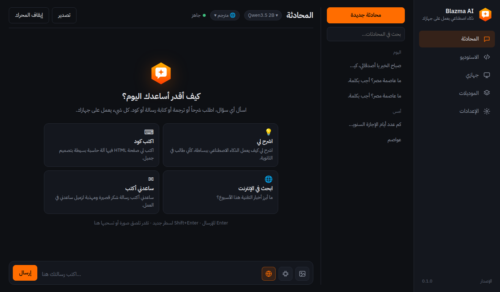
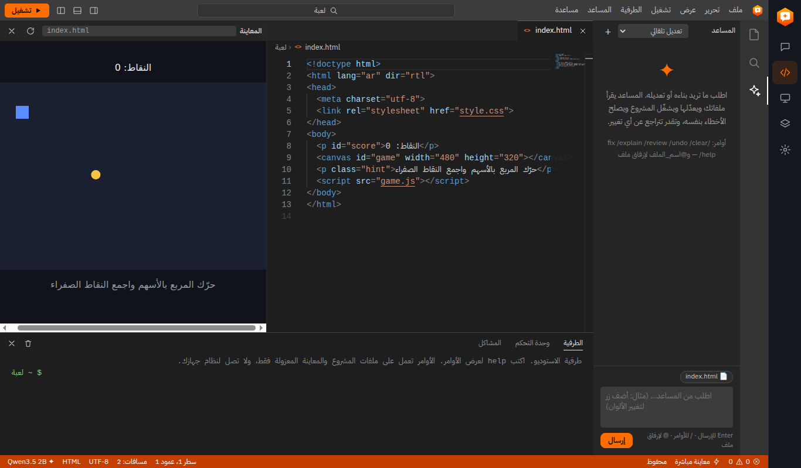
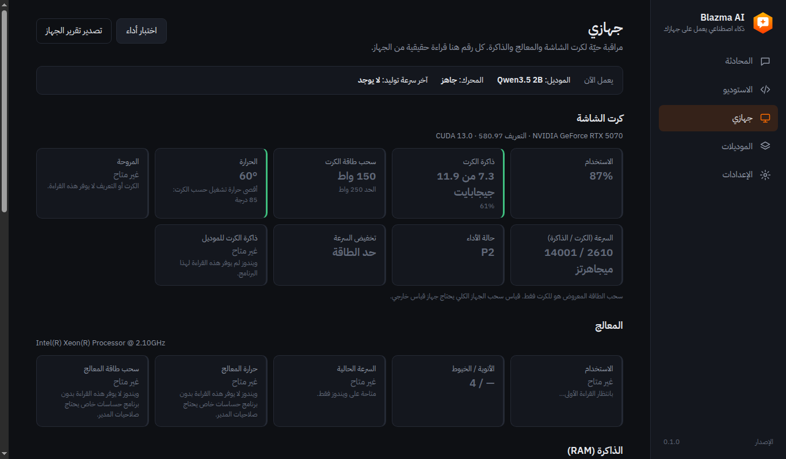
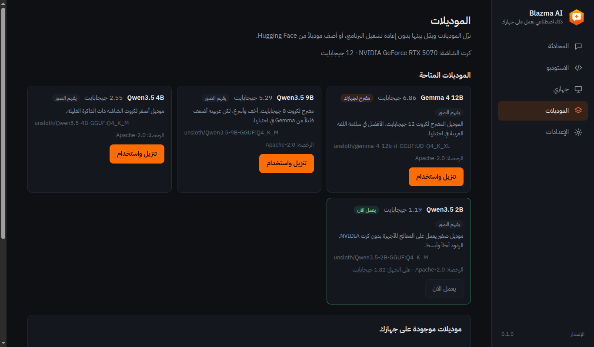

<div dir="rtl">

<p align="center"></p>

# Blazma AI

تطبيق ويندوز مفتوح المصدر بواجهة عربية كاملة، يجمع شيئين:

1. **محادثة مع ذكاء اصطناعي يعمل محلياً** على كرت الشاشة في جهازك (موديلات مفتوحة فوق محرك [llama.cpp](https://github.com/ggml-org/llama.cpp)).
2. **لوحة مراقبة حيّة للجهاز**: كرت الشاشة والمعالج والذاكرة والحرارة وسحب الطاقة (المرحلة 2).

> ⚠️ المشروع قيد البناء (المرحلة 2). المحادثة ولوحة "جهازي" تعملان، والباقي في الطريق.

## التثبيت

1. نزّل `Blazma-AI-Setup-<الإصدار>.exe` من صفحة [Releases](https://github.com/mr-kateba/blazma-ai/releases)، بعد نشر أول إصدار.
2. شغّله واختر مكان التثبيت.
   - البرنامج غير موقّع رقمياً بعد، فقد يظهر تحذير SmartScreen. اضغط "مزيد من المعلومات" ثم "تشغيل على أي حال".
3. عند أول تشغيل يفحص البرنامج جهازك، ويقترح الموديل المناسب، وينزّل المحرك والموديل مرة واحدة.

| المحادثة | الاستوديو |
|---|---|
|  |  |
| **جهازي** | **الموديلات** |
|  |  |

الصور ملتقطة في بيئة اختبار على لينكس، وقراءات كرت الشاشة فيها من محاكٍ للاختبار وليست من جهاز حقيقي.

## الحالة الحالية

| الجزء | الحالة |
|---|---|
| هيكل التطبيق والأمان والواجهة العربية | ✅ يعمل |
| فحص الجهاز واقتراح الموديل المناسب | ✅ يعمل |
| تنزيل محرك llama.cpp تلقائياً واختيار نسخة CUDA المناسبة لتعريفك | ✅ يعمل (جُرّب على ويندوز + RTX 5070) |
| تنزيل الموديل بتقدّم حقيقي، والاستكمال تلقائياً بعد انقطاع الإنترنت | ✅ يعمل |
| المحادثة: بث الرد، منطقة "يفكّر"، اتجاه النص التلقائي، markdown آمن، زر إيقاف | ✅ يعمل |
| إرسال صور للموديل ليفهمها (إرفاق، لصق، سحب) | ✅ يعمل (جُرّب على لينكس بـQwen3.5 2B) |
| إرفاق ملفات في المحادثة: PDF وWord والنصوص والكود (العربي في PDF يُقرأ بالترتيب الصحيح) | ✅ مُجرّب |
| ضغط ذاكرة المحادثة (KV cache) لمحادثات أطول بنفس الكرت | ✅ |
| الشخصيات (مترجم، مدرّس، مبرمج، مدقق لغوي، كاتب، ملخِّص، وشخصياتك الخاصة) وتصدير المحادثة إلى Markdown أو PDF | ✅ مُجرّب |
| تشغيل ملف GGUF من جهازك، واستخدام موديلات Ollama المنزّلة بدون تنزيلها مرة ثانية | ✅ مُجرّب ببنية Ollama، ⚠️ يُجرَّب مع Ollama حقيقي |
| **الاستوديو** بشكل VS Code: محرر Monaco (إكمال تلقائي وأخطاء أثناء الكتابة)، شجرة ملفات، لوحة أوامر، طرفية معزولة، معاينة مباشرة، قوالب، فتح مجلد، ومساعد يعمل بطريقة Claude Code (تعديلات دقيقة، ومراجعة، وتراجع، وقائمة مهام) | ✅ مُجرّب على لينكس |
| حفظ المحادثات والبحث فيها، إعادة التوليد، تعديل الرسائل، "أعطِ الذكاء معلومات جهازي"، حفظ الكود كملف | ✅ مُجرّب |
| البحث في الإنترنت وقراءة الصفحات (الموديل يقرر متى، مع المصادر تحت الإجابة) | ✅ حلقة الأدوات مُجرّبة بالموديل الحقيقي، ⚠️ الاتصال الفعلي بـDuckDuckGo من داخل التطبيق يُجرَّب على ويندوز |
| إيقاف المحرك عند إغلاق التطبيق وتنظيفه بعد الانهيار | ✅ يعمل |
| رسائل الأخطاء بالعربي مع اقتراح الحل | ✅ يعمل |
| العمل بدون كرت NVIDIA (على المعالج بموديل صغير) | ✅ يعمل |
| مقارنة Qwen3.5 9B وGemma 4 12B على كرت الشاشة | ⏳ تحتاج تجربة على جهاز فيه كرت NVIDIA |
| لوحة "جهازي": قراءات حيّة، رسوم لآخر 5 دقائق، تنبيهات حرارة، اختبار أداء، تصدير تقرير | ✅ مكتوبة ومُختبرة على لينكس، ⚠️ بانتظار مطابقة الأرقام على ويندوز ([القائمة](docs/CHECKLIST-PHASE2.md)) |
| صفحة الموديلات: تنزيل وتبديل بدون إعادة تشغيل، حذف من الجهاز، إضافة موديل من Hugging Face بعد التحقق منه | ✅ مُجرّب على لينكس |
| صفحة الإعدادات الكاملة: تعليمات الذكاء، درجة الإبداع، ذاكرة المحادثة، طبقات الكرت، المنفذ، مجلد الموديلات، التشغيل مع ويندوز، التحقق من التحديثات وتحديث المحرك | ✅ مُجرّب على لينكس، ⚠️ تحديث المحرك والتشغيل مع ويندوز يُجرَّبان على ويندوز |
| المحادثة: شاشة ترحيب باقتراحات، تبديل الموديل من أعلى المحادثة، تجميع المحادثات حسب التاريخ، اختصارات Ctrl+1 إلى Ctrl+5 للصفحات | ✅ مُجرّب |
| ملف التنصيب (NSIS) والأيقونة، وبناؤه تلقائياً على ويندوز عبر GitHub Actions | ✅ البرنامج المغلّف مُجرّب، ⚠️ ملف Setup.exe النهائي يُبنى على ويندوز |

خطة البناء الكاملة في [docs/PLAN.md](docs/PLAN.md).

## كيف يعمل

1. **أول تشغيل:** يفحص التطبيق كرت الشاشة عبر `nvidia-smi`، ويقترح موديلاً يناسب ذاكرة الكرت.
2. **المحرك:** ينزّل أحدث إصدار ويندوز من [llama.cpp على GitHub](https://github.com/ggml-org/llama.cpp/releases). أسماء الملفات تُقرأ من الإصدار نفسه، ويختار أحدث نسخة CUDA يدعمها تعريف كرتك. بعد التنزيل يتحقق من الحجم ومن بصمة SHA-256، ثم يتأكد أن المحرك يرى الكرت فعلاً. إذا لم يعمل يجرّب نسخة CUDA أقدم، ثم Vulkan، ثم المعالج.
3. **الموديل:** يشغّل `llama-server` بخيار `-hf` فينزّل الموديل من Hugging Face، ومعه ملف الرؤية (mmproj) الذي يسمح له بفهم الصور. يستكمل التنزيل من حيث توقف إذا انقطع الإنترنت. شريط التقدم يقيس حجم الملف الفعلي على القرص، وبعد التنزيل يتحقق التطبيق من بصمة SHA-256 للموديل.
4. **المحادثة:** الواجهة تتصل مباشرة بالخادم المحلي `http://127.0.0.1:<port>/v1/chat/completions` وتعرض الرد كلمة بكلمة.

## الموديلات

| الموديل | الملف على Hugging Face | الحجم | الرخصة | متى يُقترح |
|---|---|---|---|---|
| Gemma 4 12B | `unsloth/gemma-4-12b-it-GGUF:UD-Q4_K_XL` | 7.37 GB | Apache-2.0 | كروت 10 جيجابايت فأكثر (**الافتراضي**) |
| Qwen3.5 9B | `unsloth/Qwen3.5-9B-GGUF:Q4_K_M` | 5.68 GB | Apache-2.0 | كروت 8 جيجابايت |
| Qwen3.5 4B | `unsloth/Qwen3.5-4B-GGUF:Q4_K_M` | 2.74 GB | Apache-2.0 | كروت 4 جيجابايت |
| Qwen3.5 2B | `unsloth/Qwen3.5-2B-GGUF:Q4_K_M` | 1.28 GB | Apache-2.0 | أجهزة بدون كرت NVIDIA (يعمل على المعالج) |

- الأحجام والرخص من صفحات الموديلات على Hugging Face.
- إعدادات التوليد لكل موديل (temperature وtop_p وtop_k وغيرها) مأخوذة من صفحة الموديل الأصلي.
- على المعالج نوقف مرحلة التفكير، لأنها قد تؤخر الرد لدقائق.
- **صفحة الموديلات:**
  - تبدّل بين الموديلات بدون إعادة تشغيل البرنامج. الموديل غير المنزّل ينزل أولاً مع شريط تقدّم.
  - تحذف ملفات أي موديل من جهازك، إلا الموديل الذي يعمل الآن.
  - تضيف أي موديل GGUF من Hugging Face بصيغة `owner/repo-GGUF:QUANT`. البرنامج يتحقق أن المستودع والصيغة موجودان قبل الإضافة، ويحسب الحجم منه.
  - **الموديلات المضافة:** رخصتها مسؤوليتك، فراجعها في صفحتها على Hugging Face.

### مقارنة الموديلين

**الترشيح: Gemma 4 12B كافتراضي لكروت 10 و12 جيجابايت، وQwen3.5 9B لكروت 8 جيجابايت.**

**طريقة الاختبار:**
- عشرة أسئلة بالعربي: شرح، تلخيص، ترجمتان، سؤال عام، رسالة رسمية، كود، سؤال تقني، إعراب، أفكار مشاريع.
- رسالة النظام الافتراضية للتطبيق، وإعدادات التوليد الموصى بها لكل موديل، وحد 450 توكن للرد.
- شُغّل على **المعالج** في بيئة التطوير (4 أنوية)، لأنها بدون كرت شاشة، ومع إيقاف التفكير لأسباب الوقت. لهذا تُقارن السرعة بين الموديلين هنا، لكنها لا تمثل سرعة الكرت.
- الإجابات الكاملة في [docs/comparison](docs/comparison).

| المعيار | Qwen3.5 9B | Gemma 4 12B |
|---|---|---|
| الإعراب (كتبَ الطالبُ الدرسَ) | ❌ خاطئ ("مبني على السكون")، ودخل في تكرار حتى نهاية الحد | ✅ صحيح كاملاً |
| سلامة اللغة | ⚠️ ظهر حرف صيني وسط الرسالة الرسمية ("شكرًا不尽")، وبعض العبارات الركيكة | ✅ فصحى سليمة وأسلوب رسمي ممتاز |
| المعلومات العامة (عاصمة أستراليا) | ⚠️ الجواب صحيح، لكنه ادعى أن كانبرا "في وسط القارة" | ✅ صحيح وواضح |
| الكود (palindrome) | ✅ صحيح، ويتجاهل الرموز أيضاً | ✅ صحيح، مع شرح أطول |
| الترجمة والتلخيص | ✅ ممتاز ومختصر | ✅ ممتاز، مع مقدمات زائدة ("الترجمة هي:") |
| الإسهاب | مختصر | أطول، ويبدأ أحياناً بـ"أهلاً بك!" |
| السرعة على المعالج | 3.8 توكن/ث | 3.0 توكن/ث (أبطأ بحوالي 25%) |
| حجم الملف | 5.68 GB | 7.37 GB |

- **مع تفعيل التفكير (كما يعمل على الكرت):** أعدنا سؤالَي الإعراب والرسالة على Qwen.
  - الرسالة صارت سليمة بدون الحرف الصيني.
  - الإعراب: فكّر 3000 توكن ولم يصل لجواب.
- **لم يُقَس بعد (يحتاج كرت NVIDIA):** السرعة على الكرت، واستهلاك ذاكرة الكرت، وأداء Gemma مع التفكير. الخطوات في [docs/CHECKLIST-PHASE1.md](docs/CHECKLIST-PHASE1.md).

## لوحة "جهازي"

- **كرت الشاشة (NVIDIA):**
  - القراءات: الاستخدام، الذاكرة، سحب الطاقة وحدّه، الحرارة، المروحة، السرعة، حالة الأداء، وأسباب تخفيض السرعة.
  - المصدر: `nvidia-smi`. الحقول المطلوبة تُقرأ من `nvidia-smi --help-query-gpu` على جهازك نفسه، فلا نطلب حقلاً لا يعرفه تعريفك.
  - يُعرض أيضاً كم يأخذ الموديل من ذاكرة الكرت.
- **المعالج:**
  - القراءات: الاستخدام الكلي ولكل نواة، والسرعة الحالية، وعدد الأنوية والخيوط.
  - **حرارة المعالج وطاقته "غير متاح":** ويندوز لا يوفر قراءة موثوقة لها بدون برنامج حساسات خاص يحتاج صلاحيات المدير وتعريف نواة. لا نعرض أرقاماً تقديرية أبداً. الخيارات موثّقة في [docs/PLAN.md](docs/PLAN.md) بانتظار قرار.
- **الذاكرة والتخزين والجهاز:** الذاكرة المستخدمة والمتاحة ونوعها وسرعتها، والمساحة الفاضية، وحجم الموديلات، ونسخة ويندوز، والبطارية.
- **حدود التنبيه:** الافتراضية مأخوذة من الحد الذي يعلنه الكرت نفسه ("GPU Max Operating Temp" في `nvidia-smi -q`). لـRTX 5070 الحد الرسمي 85 درجة حسب صفحة NVIDIA. تستطيع تغييرها من الإعدادات.
- **سحب الطاقة المعروض هو للكرت فقط.** قياس سحب الجهاز الكلي يحتاج جهاز قياس خارجي.
- **التحديث يتوقف** عندما تكون الصفحة مغلقة أو النافذة مصغّرة. بينما يعمل الموديل يبقى فحص خفيف للحرارة كل 10 ثوانٍ لإظهار التنبيهات.

## الاستوديو

صفحة "الاستوديو" بيئة برمجة داخل التطبيق، بشكل وطريقة عمل VS Code:

- **المحرر: [Monaco](https://github.com/microsoft/monaco-editor)**، وهو نفس محرر VS Code:
  - **إكمال تلقائي:** اكتب `document.` فتظهر الاقتراحات.
  - **خط أحمر تحت الأخطاء أثناء الكتابة:** تظهر أيضاً في "المشاكل".
  - **الكتابة في أكثر من مكان:** Alt+Click، أو Ctrl+D.
  - **F2** لإعادة تسمية متغير في كل الملف.
  - **Shift+Alt+F** لتنسيق الملف.
  - طي الكود، والخريطة المصغرة، وتلوين الأقواس.
  - **تغيير الإعدادات:** التفاف الأسطر بـ Alt+Z، وحجم الخط بـ Ctrl+= وCtrl+-.
  - إذا تعذّر تحميل Monaco، يعمل الاستوديو بمحرر بسيط بديل.
  - نصوص Monaco الداخلية الصغيرة (مثل نافذة البحث) بالإنجليزية، لأنه لا توجد لها ترجمة عربية رسمية.
- **الواجهة:**
  - شريط قوائم، وشريط نشاط، وشجرة ملفات بمجلدات، وتبويبات.
  - معاينة جانبية، ولوحة سفلية فيها الطرفية ووحدة التحكم والمشاكل.
  - شريط حالة.
  - شريط التطبيق الجانبي يصغر لأيقونات فقط في الاستوديو، ليعطي مساحة أكبر.
- **الأوامر:**
  - لوحة الأوامر: Ctrl+Shift+P أو F1.
  - فتح ملف بالاسم: Ctrl+P.
  - الانتقال إلى سطر: Ctrl+G.
  - البحث في كل الملفات: Ctrl+Shift+F.
  - الاختصارات تعمل مع لوحة المفاتيح العربية.
- **المشاريع:**
  - **قوالب للمشاريع الجديدة** (Ctrl+Shift+N): صفحة ويب، فارغ، لعبة Canvas، JavaScript فقط.
  - **"فتح مجلد من جهازك":** ينسخ الملفات النصية لمجلد تختاره إلى مشروع جديد. لا يغيّر المجلد الأصلي، ويتجاهل `node_modules` والملفات المخفية والملفات الكبيرة.
  - **"تصدير":** يحفظ المشروع في مجلد تختاره.
- **التشغيل:**
  - F5 يشغّل المشروع، وCtrl+F5 يشغّل الملف الحالي.
  - "المعاينة المباشرة" تعيد التشغيل بعد كل تعديل.
  - الأخطاء تظهر في "المشاكل" بالملف والسطر.
  - وحدة التحكم تنفّذ تعبيرات JavaScript داخل الصفحة المشغّلة.
- **الطرفية:**
  - أوامرها: `ls` و`cd` و`cat` و`touch` و`mkdir` و`rm` و`mv` و`cp` و`echo > ملف` و`tree`، و`node ملف.js`، و`js تعبير`، و`npm start`، و`ai طلبك`.
  - **كل أوامرها تعمل على ملفات المشروع والمعاينة المعزولة فقط، ولا يمرَّر أي أمر لنظام جهازك.**
- **المساعد، ويعمل بطريقة Claude Code:**
  - ينفّذ بنفسه بأدوات: قراءة ملف، وتعديل جزء محدد من ملف (بدلاً من إعادة كتابته كله)، وإنشاء وحذف، وبحث في كل الملفات، وتشغيل المشروع وقراءة الأخطاء، وأوامر الطرفية المعزولة.
  - **يعرض كل خطوة كبطاقة:** تعديل مع الفرق الدقيق (+ و−)، أو تشغيل مع عدد الأخطاء، أو أمر مع مخرجاته.
  - **قائمة مهام** يكتبها ويحدّثها أثناء العمل في الطلبات الكبيرة.
  - **بعد كل طلب:** قائمة بالملفات التي تغيّرت، مع **"مراجعة"** (نافذة فروقات مثل VS Code) و**"تراجع"** يعيد الملفات كما كانت قبل الطلب.
  - **وضع "اسألني قبل التعديل":** يعرض كل تغيير قبل تطبيقه، مع زري قبول ورفض.
  - **يعرف سياقك:** الملف المفتوح، والكود المحدد (مع زر لإيقاف ذلك)، و`@اسم_الملف` يرفق محتوى ملف.
  - **أوامر:** `/fix` لإصلاح المشاكل الظاهرة، و`/explain`، و`/review`، و`/undo`، و`/clear`، و`/help`.
  - **من المحرر:** زر يمين على كود محدد، ثم "اشرح" أو "أصلح".
  - **تجربة حقيقية:** Qwen3.5 2B على المعالج، مع طلب "غيّر لون المربع إلى الأحمر واجعل سرعته 5 ثم شغّل". الموديل قرأ الملف، ثم عدّل سطرين بدقة، ثم شغّل المشروع بدون أخطاء، خلال 34 ثانية.
- **العزل:** التشغيل يتم داخل إطار له عنوانه الخاص `studio://preview`، المختلف عن عنوان التطبيق.
  - لا يصل للإنترنت ولا لخادم الموديل.
  - لا يصل لملفاتك ولا لبقية التطبيق ولا لـ`window.blazma`.
  - لا يفتح نوافذ، ولا يستطيع الانتقال لأي موقع.
- **من المحادثة:** زر "فتح في الاستوديو" على أي كود HTML/CSS/JavaScript يفتحه في مشروع جديد.
- **لغات أخرى** (مثل بايثون) لا تعمل داخل الاستوديو بعد.

## التشغيل من الكود المصدري

المتطلبات: ويندوز 10 أو 11، و[Node.js](https://nodejs.org) (نسخة LTS)، و[Git](https://git-scm.com).

```powershell
cd $HOME
git clone https://github.com/mr-kateba/blazma-ai.git
cd blazma-ai
npm install
npm start
```

للتشخيص عند وجود مشكلة: `npm run diag`. يحفظ تقريراً في `diag-report.txt` بدون اسم المستخدم.

## الخصوصية والأمان

- لا توجد أي تحليلات أو تتبع (telemetry).
- المحادثات تبقى على جهازك فقط.
- التطبيق يتصل بالإنترنت فقط من أجل:
  - تنزيل المحرك من GitHub.
  - تنزيل الموديلات من Hugging Face.
  - **البحث في الإنترنت عندما يقرر الموديل ذلك** (زر الكرة الأرضية بجانب خانة الكتابة، مفعّل افتراضياً ويمكن إيقافه).
    - عند البحث يُرسل **نص البحث فقط** إلى DuckDuckGo، وليس المحادثة.
    - عند قراءة صفحة يُطلب رابطها من موقعها.
    - الموديل لا يفتح إلا روابط ظهرت في نتائج البحث أو كتبتها أنت.
    - لا يفتح أي عنوان على جهازك أو شبكتك المحلية.
  - التحقق من التحديثات، فقط عند الضغط على "تحقق الآن" في الإعدادات. طلب لـGitHub عن آخر إصدار من البرنامج ومن المحرك.
- الخادم المحلي يستمع على `127.0.0.1` فقط، ولا يمكن الوصول إليه من الشبكة.
- لكل تشغيل مفتاح عشوائي جديد يُمرَّر للخادم عبر متغير بيئة، فلا يظهر في قائمة العمليات.
- الخادم لا يقبل إلا طلبات التطبيق نفسه، فلا تستطيع أي صفحة ويب مفتوحة في متصفحك استخدام الموديل.
- الواجهة معزولة عن النظام، وعليها سياسة CSP صارمة تمنع أي اتصال غير الخادم المحلي.
  - السكربتات: من ملفات التطبيق فقط (`script-src 'self'`).
  - الأنماط: تسمح بـ`'unsafe-inline'` لأن محرر Monaco يضيف عناصر `<style>` بنفسه ولا يدعم nonce. الصور والخطوط والاتصالات محصورة بالتطبيق والخادم المحلي، فلا يستطيع أي CSS أن يرسل بيانات لأي مكان.
  - الـWorkers: تسمح بـ`blob:`، لأن Monaco يشغّل عامله المساعد منه، وهو يستورد ملفات Monaco المحلية فقط.
- ردود الموديل تُعرض كنص فقط، ولا يُنفَّذ أي HTML فيها.

## الحدود المعروفة

- **البحث في الإنترنت:**
  - الموديل يقرر متى يبحث، ومعلوماته بدون بحث تتوقف عند تاريخ تدريبه.
  - يُطلب منه البحث في الأسعار والأخبار وكل ما يتغير، وألا يذكر أرقاماً إذا فشل البحث. الموديلات الصغيرة (2B) قد تخالف هذا أحياناً.
  - البحث عبر DuckDuckGo بدون حساب، وقد يرفض الطلبات الكثيرة المتتالية.
  - التطبيق يعطي الموديل تاريخ اليوم وساعته مع كل محادثة.
- **الصور:** الموديل **يفهم** الصور التي ترسلها (زر الصورة، أو اللصق، أو السحب)، لكنه **لا يرسم** صوراً.

- الموديل الصغير على المعالج (2B) لغته العربية سليمة، لكنه يخطئ أحياناً في المعلومات والحساب. موديل 4B أدق بشكل واضح لكنه أبطأ بمرتين.
- إذا أُغلق التطبيق بالقوة (مثلاً "إنهاء المهمة")، قد يبقى المحرك يعمل حتى تفتح التطبيق مرة أخرى، وعندها يغلقه تلقائياً.

## الرخصة والإسناد

- التطبيق: رخصة [MIT](LICENSE).
- محرك التشغيل: [llama.cpp](https://github.com/ggml-org/llama.cpp)، رخصة MIT. ينزّله التطبيق من إصداراته الرسمية.
- الموديلات: Qwen3.5 من Alibaba Cloud، وGemma 4 من Google، وكلاهما برخصة Apache-2.0. ملفات GGUF من [Unsloth](https://huggingface.co/unsloth).
- الخط: IBM Plex Sans Arabic، رخصة SIL Open Font License 1.1 ([src/renderer/fonts/OFL.txt](src/renderer/fonts/OFL.txt)).
- قراءة PDF: [pdf.js](https://github.com/mozilla/pdf.js) (Apache-2.0). قراءة Word: [mammoth](https://github.com/mwilliamson/mammoth.js) (BSD-2-Clause).
- محرر الكود في الاستوديو: [Monaco Editor](https://github.com/microsoft/monaco-editor) من Microsoft، رخصة MIT. يأتي مع التطبيق ويعمل بدون إنترنت. رخص مكوّناته في `node_modules/monaco-editor/ThirdPartyNotices.txt`.

</div>

---

## English

**Blazma AI** is an open-source Windows app with a fully Arabic (RTL) interface. It combines a chat with open models running locally on your GPU (through llama.cpp's `llama-server`) and a live hardware monitor (GPU, CPU, RAM, temperatures, power draw).

**Status:** phase 1. Local chat works end to end:
- hardware detection and model recommendation;
- automatic llama.cpp download with CUDA version selection and a fallback chain;
- resumable model download with real progress;
- streaming chat with a collapsible reasoning section and safe Markdown rendering.

Windows-specific paths are written but still awaiting testing on a real Windows + NVIDIA machine.

**Run from source:** `npm install && npm start`.

**Privacy:** no telemetry. The network is used to download the engine (GitHub) and models (Hugging Face), for optional web search by the model (only the search query goes to DuckDuckGo; pages are fetched only from search results or links the user typed; local/private addresses are blocked), and later to check for updates. The local server binds to 127.0.0.1, requires a per-session random API key, and only accepts the app's own origin.

**License:** MIT. llama.cpp is MIT. Qwen3.5 and Gemma 4 are Apache-2.0. IBM Plex Sans Arabic is OFL-1.1.
